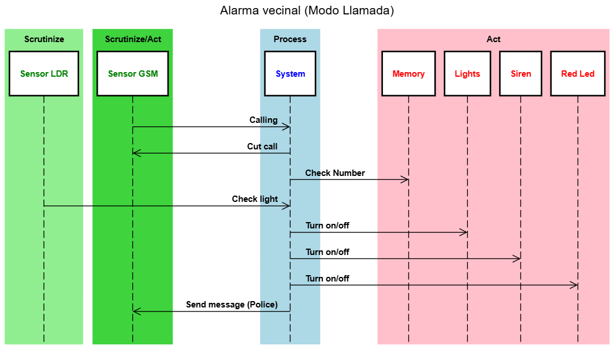
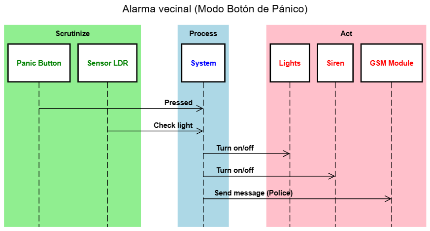
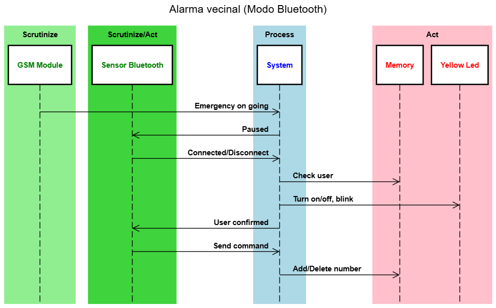
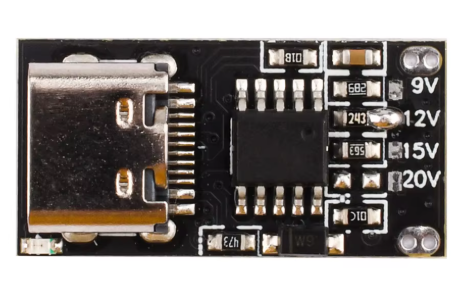
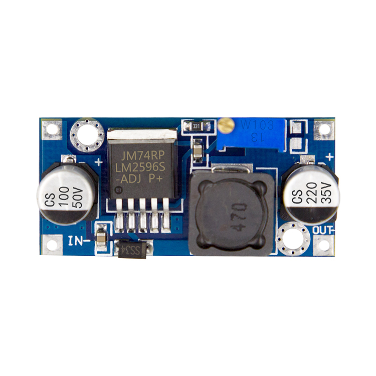
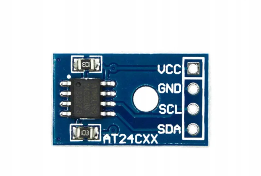
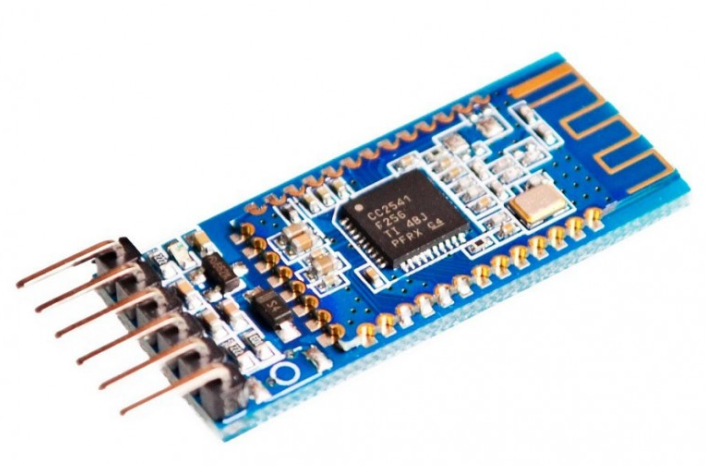
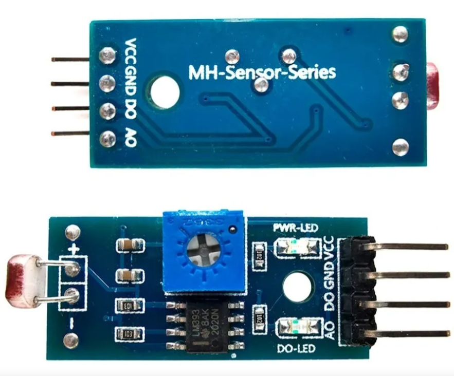
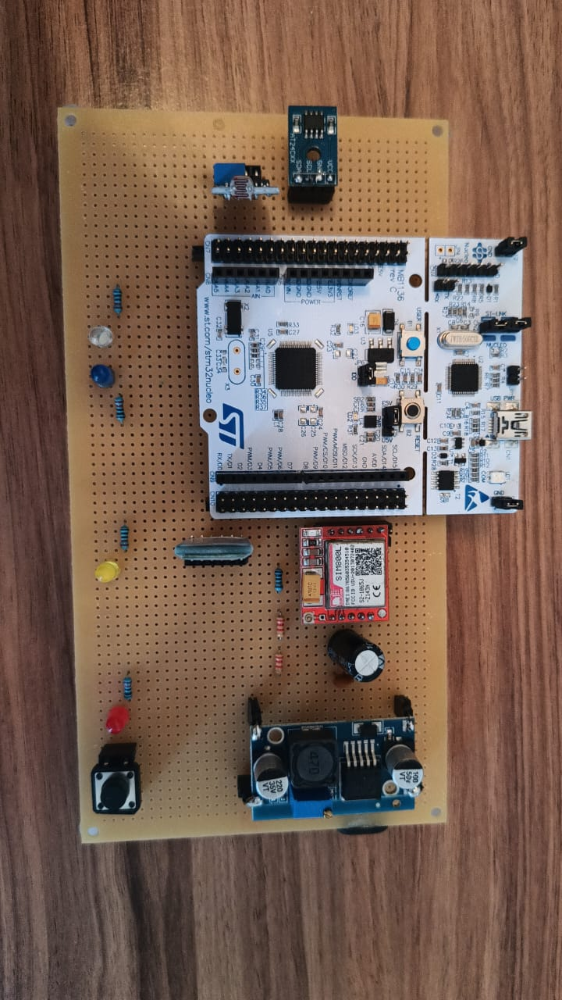
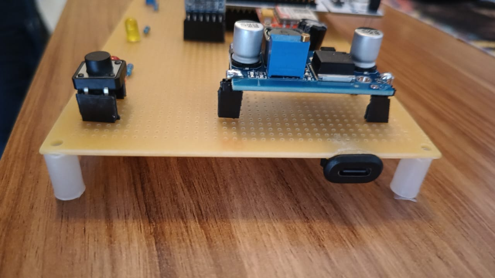

<p align="center">
  
</p>

<p align="center">
  <strong>UNIVERSIDAD DE BUENOS AIRES</strong>
</p>

<p align="center">
  <strong>Facultad de Ingeniería</strong>
</p>

<p align="center">
  <strong>86.65/TA134 Taller de Sistemas Embebidos</strong>
</p>

# Memoria del trabajo final: **Alarma vecinal**

<table align="center">
  <tr>
    <th>Autor</th>
    <th>Padrón</th>
  </tr>
  <tr>
    <td>Valentín Alexis Guirin</td>
    <td>107416</td>
  </tr>
  <tr>
    <td>Yerson Monzón Alayo</td>
    <td>104262</td>
  </tr>
  <tr>
    <td>Carolina Gonzales Peralta</td>
    <td>110804</td>
  </tr>
</table>

<p align="center">
  <em>Este trabajo fue realizado en la Ciudad Autónoma de Buenos Aires, entre diciembre de 2025 y marzo de 2026.</em>
</p>

# RESUMEN
En el presente trabajo se diseñó e implementó una alarma vecinal. Se pretendía solucionar la problemática de inseguridad en barrios comprometidos de la Ciudad de Buenos Aires o sus alrededores.
Mediante un módulo GSM y un botón de pánico se logró que los usuarios puedan hacer sonar una alarma sonora y con luz estroboscópica para notificar a la policía y a la central inmediatamente. Para su mantenimiento, un vecino encargado puede conectarse a través del módulo BLE con doble factor de autenticación.
La importancia de este trabajo radica en la consolidación de lo aprendido en la materia en cuestión en un trabajo integral de este calibre, además de solucionar potencial y parcialmente el problema de la inseguridad ya mencionado. El actual trabajo es una buena representación de lo aprendido durante la cursada del Taller de Sistemas Embebidos ya que involucra el manejo de la placa STM para comunicar módulos entre sí, vinculando así la implementación de un código con la interconexión de los distintos elementos que componen al sistema.
En esta Memoria se encontrará la motivación del proyecto, diseños de partes y la propuesta de posibles mejoras a implementar.

# ABSTRACT
This paper describes the design and implementation of a neighborhood alarm system aimed at addressing security concerns in high-risk areas of the City of Buenos Aires. By utilizing a GSM module and a panic button, users can trigger an audible alarm and a strobe light to notify both the neighborhood and a central station. For maintenance purposes, technicians can connect via a BLE (Bluetooth Low Energy) module using their personal credentials.
The significance of this project lies in the consolidation of the knowledge acquired throughout the course into a comprehensive technical application, while offering a potential solution to the aforementioned security issues. This project serves as a robust representation of the learning outcomes from the Embedded Systems course, as it involves programming an STM board to manage inter-module communication, effectively linking software implementation with the interconnection of diverse hardware components.
This report details the project’s motivation, component designs, and proposes future enhancements.

# Agradecimientos
Agradecemos, como grupo, al Ingeniero Juan Manuel Cruz por el tiempo dedicado a ayudarnos con el desarrollo del proyecto en tiempo real, ya sea desde responder consultas en cualquier momento a personalmente intervenir en las complicaciones tan específicas que fueron surgiendo en todo momento.
También, al Dr. Ingeniero Ariel Lutenberg, por su impecable predisposición en todo momento para solucionarnos cualquier consulta referida a cualquier cuestión por más técnica y específica que sea, y por estar atento a hacernos el proceso de generar el proyecto final mucho más ameno de lo que podría haber sido.
A ambos les agradecemos por la motivación genuina por los sistemas embebidos que han  generado en nosotros como estudiantes de Ingeniería Electrónica, haciendo que un proyecto con tiempos de entrega determinados y un examen con su intrínseca burocracia detrás, se vuelva algo placentero de transitar.

# Índice general
- [Agradecimientos](#agradecimientos)	
- [Registro de versiones](#registro-de-versiones)
- [Introducción general](#introducción-general)
  - [1.1 Problemática a resolver](#11-problemática-a-resolver)	
  - [1.2 Solución a implementar](#12-solución-a-implementar)
  - [1.3 Análisis de sistemas similares al desarrollado](#13-análisis-de-sistemas-similares-al-desarrollado)
- [Introducción específica](#introducción-específica)
  - [2.1 Requisitos](#21-requisitos)
  - [2.2 Casos de uso](#22-casos-de-uso)
  	- [2.2.1 Diagramas de secuencia del sistema](#221-diagramas-de-secuencia-del-sistema)
  - [2.3 Descripción módulos del sistema](#23-descripción-módulos-del-sistema)
    - [2.3.1 Alimentación](#231-alimentación)
    - [2.3.2 Microcontrolador](#232-microcontrolador)
    - [2.3.3 Módulo GSM](#233-módulo-gsm)
    - [2.3.4 Memoria EEPROM AT24C256](#234-memoria-eeprom-at24c256)
    - [2.3.5 Módulo Bluetooth](#235-módulo-bluetooth)
    - [2.3.6 Módulo sensor de luz](#236-módulo-sensor-de-luz)	
    - [2.3.7 Indicadores](#237-indicadores)
    - [2.3.8 Aplicación de celular](#238-aplicación-de-celular)
    - [2.3.9 Conexionado](#239-conexionado)
- [Diseño e implementación](#diseño-e-implementación)
  - [3.1 Diseño del Hardware](#31-diseño-del-hardware)
    - [3.1.1 Hardware del módulo GSM](#311-hardware-del-módulo-gsm)
    - [3.1.2 Hardware del módulo HM-10](#312-hardware-del-módulo-hm-10)
    - [3.1.3 Hardware del módulo sensor de luz LDR](#313-hardware-del-módulo-sensor-de-luz-ldr)
    - [3.1.4 Hardware de la memoria EEPROM AT24C256](#314-hardware-de-la-memoria-eeprom-at24c256)
  - [3.2 Diseño del Firmware](#32-diseño-del-firmware)
    - [3.2.1 Main](#321-main)
    - [3.2.2 Botón de pánico](#322-botón-de-pánico)
    - [3.2.3 Sensor de luz](#323-sensor-de-luz)
    - [3.2.4 Módulo Bluetooth](#324-módulo-bluetooth)
    - [3.2.5 Módulo GSM](#325-módulo-gsm)
    - [3.2.6 Gestión de mensajes SMS](#326-gestión-de-mensajes-sms)
- [Ensayos y resultados](#ensayos-y-resultados)
  - [4.1 Desarrollo y pruebas de funcionamiento](#41-desarrollo-y-pruebas-de-funcionamiento)
  - [4.2 Cumplimiento de requisitos](#42-cumplimiento-de-requisitos)
  - [4.3 Análisis de Ejecución y Consumo Energético](#43-análisis-de-ejecución-y-consumo-energético)
    - [4.3.1 Medición y análisis de consumo](#431-medición-y-análisis-de-consumo)
        - [4.3.1.1 Análisis del módulo GSM (SIM800L)](#4311-análisis-del-módulo-gsm-sim800l)
    - [4.3.2 Medición y análisis de tiempos de ejecución de cada tarea (WCET)](#432-medición-y-análisis-de-tiempos-de-ejecución-de-cada-tarea-wcet)
      - [4.3.2.1 Análisis Matemático y Conversión Temporal](#4321-análisis-matemático-y-conversión-temporal)
    - [4.3.3 Captura de pantalla de "Console & Build Analyzer"](#433-captura-de-pantalla-de-console--build-analyzer)
    - [4.3.4 Cálculo del Factor de Uso (U) de la CPU](#434-cálculo-del-factor-de-uso-u-de-la-cpu)
    - [4.3.5 Gestión del modo de bajo consumo](#435-gestión-del-modo-de-bajo-consumo)
  - [4.4 Documentación del desarrollo realizado](#44-documentación-del-desarrollo-realizado)
- [Conclusiones](#conclusiones)
  - [5.1 Resultados obtenidos](#51-resultados-obtenidos)
  - [5.2 Próximos pasos](#52-próximos-pasos)
- [Uso de herramientas de la inteligencia artificial](#uso-de-herramientas-de-la-inteligencia-artificial)
  - [6.1 Uso individual](#61-uso-individual)
- [Bibliografía](#bibliografía)

# Registro de versiones

| Revisión | Cambios realizados | Fecha |
| --- | --- | --- |
| 1.0 |Creación del documento | 24/02/2026 |
| 1.1 | Agregado de capítulos 1 y 2 |  24/02/2026 |
| 1.2 | Agregado parcial de capítulo 3 | 25/02/2026 |
| 1.3 | Capítulo 3 completo y parcialmente el capítulo 4 | 26/02/2026|
| 1.4 | Terminado el documento | 27/02/2026 |
| 1.5 | Versión final con detalles corregidos | /03/2026 |

# CAPÍTULO 1 
# Introducción general
## 1.1 Problemática a resolver
En la realidad de hoy en día y en el contexto de la Ciudad Autónoma de Buenos Aires, la inseguridad se ha vuelto un problema a tener en cuenta mayormente a medida que pasan los años. Si bien el problema trasciende en toda la ciudad, sería imprudente no destacar que la problemática en cuestión tiene un mayor impacto y se ve con mayor frecuencia en las llamadas “villas” alrededor de la ciudad.
Según estadísticas de la página de la Ciudad de Buenos Aires, las comunas en donde más delitos se presentan son en aquellas en las que hay villas. Particularmente, en la Comuna 1 es en la que más delitos hubo en diciembre de 2024 y en la que se asienta la Villa 31, la más poblada de la ciudad. En la Figura 1.1 se detalla la distribución de delitos por comuna.

<p align="center">
  
</p>
<p align="center">
  <em>Figura 1.1: Mapa del delito por comuna. Colores claros indican menos delito, oscuros indican alto.</em>
</p>

Nuestro proyecto fue pensado para instalarse en las villas, en donde la comunidad barrial pueda unirse y organizarse. La idea fue crear un dispositivo que cualquier vecino pueda alertar a todo el barrio, aprovechando que una sola persona puede hacer que todos reaccionen.
El hecho de que sea un producto aplicado a este tipo de zonas, viene también de la mano con el personal policial disponible para tanta área. Al no tener la ciudad el presupuesto para poner mayor cantidad de personal de seguridad en cada esquina de las villas, la única opción viable es que los habitantes se cuiden entre sí, y es por eso que nuestra alarma vecinal fue diseñada para combatir los hechos delictivos aislados por el bajo control policial, haciendo de la red de vecinos una red segura y menos atractiva para quienes delinquen.
El hecho de haber elegido las villas como mercado fue producto de reconocer que son las zonas de la ciudad con menor seguridad disponible y de entender que las zonas más urbanizadas de la ciudad son mucho más seguras y ya hay soluciones mucho menos sofisticadas que cumplen perfectamente la función de cuidar a los vecinos.
## 1.2 Solución a implementar
La solución al problema de la inseguridad en las villas no se soluciona exclusivamente con una alarma vecinal, pero sí se puede reducir considerablemente la costumbre delictiva que está presente y en crecimiento en esas partes de la ciudad.
Nuestro producto fue pensado y diseñado para ahuyentar y alertar. Posee un botón de pánico accesible para cualquier persona que esté pasando por una situación de inseguridad o para cualquier testigo de alguna. La funcionalidad que fue añadida pensando en los posibles escenarios de delincuencia fue la posibilidad de que algún vecino realice una llamada al número asociado a la alarma y active la alarma remotamente. Esto fue implementado debido a que muchas situaciones delictivas se ven, pero no se enfrentan por miedo a involucrarse. De esta manera, creemos que haber implementado la funcionalidad mencionada, hará que muchas acciones delictivas puedan frenar antes de tiempo o mitigar sus efectos.
Además, la alarma vecinal posee una luz estroboscópica y alarma sonora. Ambas son para alertar al vecindario y ahuyentar al delincuente. La luz únicamente se prende si hay muy baja iluminación, ya que sino sería un gasto de recursos sin sentido. Cabe destacar que al tener como prioridad que se cree una red segura entre vecinos, los usuarios habilitados para llamar son exclusivamente miembros de la calle donde está instalada esta y deben ser incluidos en una whitelist que genera la central. Al momento de la instalación, el técnico podrá conectarse vía Bluetooth a la alarma con su usuario y contraseña y cargar esa lista. Privilegios de administrador serán otorgados a miembros específicos de cada comunidad para poder agregar o quitar miembros de esa lista, para así afianzar todavía más la confianza entre la red del barrio.
## 1.3 Análisis de sistemas similares al desarrollado
Existen empresas como Global Alarmas [2], Hexacom [3], Alerta Vecinal [4], Safecity [5] y Verisure [6] que ofrecen a grandes rasgos lo mismo que nuestra solución. Habiendo más de un competidor, fue importante para nosotros pensar en alguna característica distintiva que destaque entre las demás. El carácter de red vecinal profunda que promete nuestro producto es, en parte, lo que hace que nuestra alarma vecinal no solo sea una herramienta, sino un símbolo de seguridad comunitaria. 
Entre algunas de las funcionalidades que se ofrecen por estas empresas en sus productos se encuentran: sirena de luz, alerta sonora, botonera y panel de control, rastreo vehicular, emisores de humo denso, whitelist, aplicación móvil y control remoto, entre otras.
Cabe mencionar que solo una de estas empresas, Alerta Vecinal, está dedicada exclusivamente al desarrollo de alarmas para comunidades y no para domicilios particulares.
Si bien ya existen alarmas con listas tipo whitelist, nuestro concepto de whitelist descentralizada (que usuarios dentro de la red puedan operar con ella) hace que el sentimiento de comunidad sea más fuerte si se elige nuestra propuesta, además de que la construcción y mantenimiento de la alarma es muy baja. Se suma el hecho de que se puede reportar un acto ilícito de manera silenciosa y anónima mediante una llamada telefónica, solo la central sabrá qué número de la whitelist activó la alarma. Muchas alarmas ofrecen protección exclusivamente a uno mismo, mientras que nosotros brindamos la posibilidad de cuidarnos entre todos.
Por otro lado, el uso de la interfaz Bluetooth para el vecino encargado es un enfoque moderno y que facilita la instalación y mantenimiento de alarmas en puntos estratégicos y peligrosos, ya que a veces puede ser complicado operar en ciertos puntos.
Por último, el sensor de luz no es un detalle menor, ya que con esa simple incorporación el barrio consume electricidad para la iluminación únicamente cuando es necesario, y eso se ve reflejado en ahorros de energía eléctrica considerables.

# CAPÍTULO 2 
# Introducción específica
## 2.1 Requisitos
En la Tabla 2.1 se detalla la lista de requisitos a cumplimentar, con el objetivo de desarrollar un dispositivo que pueda cumplir con lo especificado en la Sección 1.2.

| Grupo | ID | Descripción |
| :---- | :---- | :---- |
|Acceso|1.1|El sistema permitirá el acceso mediante BLE.|
||1.2|En caso de acceso permitido, el sistema guardará qué usuario root ingresó.|
|Indicadores|2.1|El sistema contará con un indicador luminoso (luz estroboscópica) para indicar que hay una alerta.|
||2.2|El sistema contará con un buzzer (sirena) para indicar la activación de la alarma.|
||2.3|El sistema contará con un set de leds para indicar que la clave es correcta.|
||2.4|El sistema contará con un set de leds para indicar que la clave es incorrecta.|
||2.5|El sistema enviará un mensaje a la policía, a todos los usuarios y a la central mediante GSM para indicar qué usuario activó la alarma mediante llamada.|
||2.6|El sistema enviará un mensaje a la policía, a todos los usuarios y a la central mediante GSM para indicar que la alarma se activó mediante botón de pánico.|
||2.7|El sistema contará con un led para indicar el estado de la alarma (armada o desarmada).|
|Interruptores/Botones|3.1|El sistema contará con un botón para accionar la alarma de forma manual (botón de pánico).|
|Memoria|4.1|El sistema contará con una memoria para almacenar datos.|
||4.2|La memoria almacenará la lista de números telefónicos autorizados.|
||4.3|La memoria almacenará las coordenadas (configuradas por la central) de la ubicación de la alarma.|
|Comunicación audio|5.1|El sistema contará con un buzzer (sirena) para transmitir la alerta.|
|Comunicación BLE|6.1|El personal autorizado enviado por la central se vinculará con el sistema mediante BLE.|
|Comunicación GSM|7.1|El sistema se comunicará con los usuarios mediante la red GSM (vía SMS).|
||7.2|El sistema se comunicará con la policía mediante la red GSM (vía SMS).|
||7.3|El sistema se comunicará con la central mediante la red GSM (vía SMS).|
|Sensores|8.1|El sistema contará con un sensor lumínico para validar la luz del día.|

<p align="center">
  <em>Tabla 2.1: Requisitos del sistema a implementar.</em>
</p>

## 2.2 Casos de uso
En las tablas 2.2, 2.3 y 2.4 se presentan tres casos de uso para ejemplificar un uso común del sistema.

| Elemento | Definición |
| :---- | :---- |
|Disparador |El usuario llama al número de la alarma.|
|Precondiciones|El sistema está encendido (led de estado armado), las luces estroboscópicas apagadas y buzzer inactivo.|
|Flujo principal|El usuario llama al número guardado (previamente en su lista de contactos) de la alarma, el sistema corta la llamada, valida que el usuario esté registrado. En caso de estar registrado, enciende la sirena, la luz estroboscópica (si es de noche) y notifica a la policía, a los usuarios y a la central que se activó la alarma mediante llamada (y quién lo hizo).|
|Flujo alternativo|A. El usuario no está registrado, el sistema corta la llamada y revisa en su memoria si el número está en la base de datos. Al no encontrarlo, mantiene las precondiciones en el mismo estado y notifica a la central el número que fue utilizado.|
||B. Múltiples usuarios llaman, el sistema recibe la llamada pues corta todas a la brevedad. El sistema activó la alarma en la primera llamada, y mientras más llamadas lleguen en los próximos 60 segundos, no reacciona más que enviando los números de las redundantes llamadas a la central.|

<p align="center">
  <em>Tabla 2.2: casos de uso: el usuario activa la alarma mediante la red GSM (llamada).</em>
</p>


| Elemento | Definición |
| :---- | :---- |
|Disparador|El usuario presiona el botón de pánico.|
|Precondiciones|El sistema está encendido (led de estado armado), las luces estroboscópicas apagadas y buzzer inactivo.|
|Flujo principal|El usuario presiona el botón de pánico ubicado debajo de la alarma. Se enciende la sirena, la luz estroboscópica (si es de noche) y se notifica a la policía, a los usuarios y a la central que se activó la alarma mediante botón de pánico.|
|Flujo alternativo|A. El usuario presiona el botón cuando ya hay una llamada activa, la alarma se activa pero por la llamada previa. Los usuarios y la policía reciben el mensaje de que la alarma fue activada por llamada, mientras que la central recibe las dos activaciones.|
||B. El usuario presiona el botón cuando ya está sonando la alarma. La central es la única notificada y el estado de la alarma no cambia.|

<p align="center">
  <em>Tabla 2.3: casos de uso: el usuario activa la alarma mediante botón de pánico (llamada).</em>
</p>

| Elemento | Definición |
| :---- | :---- |
|Disparador|El personal autorizado se conecta mediante BLE.|
|Precondiciones|El sistema está encendido (led de estado armado), las luces estroboscópicas apagadas y buzzer inactivo.|
|Flujo principal|El personal autorizado se aproxima a la zona de la alarma, se conecta mediante BLE, ingresa su número de usuario y contraseña. Puede dar de alta o de baja usuarios. Tanto la información del personal autorizado como los cambios que realizó, se notifica a la central mediante SMS.|
|Flujo alternativo|A. El usuario o contraseña son incorrectos, se deniega el acceso y se notifica a la central.| 
||B. Se activa la alarma mientras se están realizando cambios, se cancelan los cambios (no se guardan), y se cierra la comunicación BLE hasta que la alarma se desactive.|

<p align="center">
  <em>Tabla 2.4: casos de uso: el personal autorizado se conecta mediante BLE al sistema (llamada).</em>
</p>

### 2.2.1 Diagramas de secuencia del sistema
Previo a empezar a programar el código del sistema, se decidio modelar diagramas de secuancia para cada caso de uso. Esto ayudará a comprender mejor el funcionamiento del sistema planteado en la sección 2.2 y así poder implementar el código de cada sensor y actuador con mayor facilidad.

En la Figura 2.1 se observa el diagrama de secuancias para el caso de activación de la alarma por llamada.
<p align="center">
  
</p>
<p align="center">
  <em>Figura 2.1: Diagrama de secuancias para el caso de activación por red GSM.</em>
</p>

En la Figura 2.2 se observa el diagrama de secuancias para el caso de activación de la alarma por botón de pánico.

<p align="center">
  
</p>
<p align="center">
  <em>Figura 2.2: Diagrama de secuancias para el caso de activación por botón de pánico.</em>
</p>

En la Figura 2.3 se observa el diagrama de secuancias para el caso de conexón de personal autorizado al sistema mediante Bluetooth.

<p align="center">
  
</p>
<p align="center">
  <em>Figura 2.3: Diagrama de secuancias para el caso de conexión de personal autorizado.</em>
</p>

## 2.3 Descripción módulos del sistema
### 2.3.1 Alimentación
Para la alimentación de todo el sistema se usó un cargador de celular de la marca Motorola®️, un módulo de carga rápida PD/QC USB C y un módulo regulador de tensión LM2596. Particularmente se optó por un cargador con la opción de "carga rápida" para poder entregar tensión y corrientes específicas y para mayor portabilidad física de la placa. La tensión de entrada elegida fue de 9 V, ya que la diferencia mínima requerida entre la entrada del LM2596 y su salida debe ser de 1,5 V, y la salida fue regulada a 4 V. En cuanto a la corriente, el cargador puede entregar hasta 3 A, así que fue más que suficiente para suplir el máximo consumo del módulo GSM (2 A). Para poder obtener esta tensión y corriente fue necesaria la adquisición del módulo de carga rápida mencionado, que funciona emulando al módulo interno de un celular moderno solicitando el poder para una carga específicamente rápida que requiera esos valores. Éste último puede apreciarse en la Figura 2.4. Por otro lado, en la Figura 2.5. se observa el módulo LM2596, que fue el encargado de recibir los 9 V del módulo de carga rápida y convertirlos a 4 V, tensión utilizada para alimentar directamente al módulo GSM, BLE y LDR.

<p align="center">
  
</p>
<p align="center">
  <em>Figura 2.4: módulo de carga rápida PD QC USB C.</em>
</p>

<p align="center">
  
</p>
<p align="center">
  <em>Figura 2.5: módulo regulador de tensión.</em>
</p>

### 2.3.2 Microcontrolador
Como controlador principal del sistema se utilizó la placa NUCLEO-F103B. Cuenta con los pines, cantidad de memoria y periféricos de sobra para lo que fue el desarrollo del proyecto. La elección de esta placa fue basada en lo mencionado recientemente.

### 2.3.3 Módulo GSM
Para recibir llamadas telefónicas de los usuarios (para su activación) y enviar mensajes de texto conteniendo información sobre la alerta, se utilizó un Módulo GSM/GPRS (SIM800L). Consta de un slot para colocar un chip de celular y pines para las siguientes conexiones:
VCC/GND: requiere una alimentación entre 3,4 V y 4,4 V. En la implementación se coloca lo más cercano posible un capacitor de 1000 μF para soportar los picos de corriente de 2 A que consume el módulo durante la transmisión a la red.
TXD/RXD: Son las señales que se utilizan para la comunicación serial mediante comandos AT.
Se tuvo que hacer un divisor resistivo entre el pin de RX de esta placa y el pin TX de la Núcleo, ya que el nivel alto lógico del módulo gsm es 2,8 V y de la placa Núcleo es 3,3 V.
NET: es el punto de conexión para la antena GSM. Se usó una de 6 dBi para que la señal se pueda recepcionar sin problemas.
El funcionamiento de este módulo consta de conectarse a la red 2G para actuar como si fuera un celular (desde el punto de vista de la comunicación). Recibe llamadas que corta luego de un RING si el usuario que llama está en la whitelist, entonces se activa la alarma. También envía mensajes SMS para notificar a la policía y central . Su elección recae en la simpleza del funcionamiento, ya que la prioridad fue atenernos a las funcionalidades pensadas para el trabajo y el módulo en cuestión se ajustaba de manera perfecta para cumplir con estos requisitos.
Se tiene en cuenta que la red 2G está siendo apagada lentamente pero en ese caso se podrá implementar esta alarma usando el módulo  SIM800L que se observa en la Figura 2.6 . Aunque, mientras eso no ocurra, por costo y utilidad esta opción es la mejor.

<p align="center">
  
</p>

<p align="center">
  <em>Figura 2.6: Módulo GSM.</em>
</p>

### 2.3.4 Memoria EEPROM AT24C256
Se optó por la EEPROM externa (AT24C256) al descartar otras alternativas por riesgos críticos.
Una opción era la tarjeta SIM pero leer contactos mediante comandos AT es un proceso demasiado lento que retrasaría inaceptablemente el disparo de la alarma durante una emergencia.
La otra era la memoria del STM32 y este microcontrolador no tiene EEPROM real. Se usaría la memoria Flash que se observa en la Figura 2.7 para guardar datos lo cual reduciría la vida útil de la placa (soporta pocas escrituras) y genera un alto riesgo de corromper el código principal si se corta la luz mientras se guarda un número.

<p align="center">
  
</p>
<p align="center">
  <em>Figura 2.7: Memoria EEPROM AT24C256.</em>
</p>

### 2.3.5 Módulo Bluetooth
Para la conexión del personal autorizado, ya sea un técnico de la empresa para instalar la alarma o un vecino de alto rango con acceso a la alta y baja de usuarios, se utilizó un Módulo HM-10 (módulo Bluetooth). Sus pines son los siguientes:
VCC/GND: se alimenta, por lo general, con 3,3 V a  6 V.
TXD/RXD: por los que se da la comunicación serial. El TX del módulo en cuestión va al RX de la placa NUCLEO-F103RB y el RX del módulo, al TX de la placa.
El HM-10 trabaja respetando el estándar BLE (Bluetooth Low Energy), lo que permite gozar del bajo consumo de energía. Recibe comandos AT para el ingreso como administrador y comandos para la alta y baja de números telefónicos. Envía confirmaciones de acceso, estado de la memoria y logs de quién ingresó al sistema mediante ese módulo. El módulo HM-10 observado en la Figura 2.8 fue elegido por su característica de bajo consumo principalmente, y también por la retroalimentación que este módulo proporciona al interactuar con él.

<p align="center">
  
</p>
<p align="center">
  <em>Figura 2.8: Módulo Bluetooth HM-10.</em>
</p>

### 2.3.6 Módulo sensor de luz
Para determinar en qué momento del día se activa la alarma, fue necesario contar con el sensor de luz observado en la Figura 2.9 para que envíe la información a la placa NUCLEO-F103RB y active (o no) la luz estroboscópica. Los pines que incluye se enumeran a continuación:
VCC/GND: se alimenta, por lo general, con 3,3 V o 5 V.
DO: es el Digital Output, el cual entrega un pulso alto o bajo que se calibra con un potenciómetro que incluye el módulo. Es importante definir el umbral según la ubicación de la alarma.
AO: es el Analog Output, el cual entrega una tensión variable y proporcional a la intensidad de la luz.
El funcionamiento se basa en que la resistencia del sensor disminuye a medida que la luz que recibe el sensor aumenta. El propio módulo transforma esta información en una señal eléctrica. Lo que recibe es luz ambiental y envía un valor lógico que la placa NUCLEO F103RB usa para validar si es de día o de noche. Fue seleccionado este módulo sin excesivo análisis ya que es un dispositivo común en la industria y era de público conocimiento que cumplía con lo básico necesario para el proyecto.

<p align="center">
  
</p>
<p align="center">
  <em>Figura 2.9: módulo sensor de luz.</em>
</p>

### 2.3.7 Indicadores
Para confirmar que las conexiones estuvieran correctas a medida que se desarrollaba el proyecto en su momento, fueron utilizados LEDs. Éstos sirvieron para verificar el correcto funcionamiento de cada parte y actualmente representan: luz estroboscópica, sirena sonora, armado/desarmado de alarma, alta/baja de números y acceso mediante Bluetooth confirmado.

### 2.3.8 Aplicación de celular
Se hizo uso de una aplicación celular llamada “Serial Bluetooth Terminal” para validar el buen funcionamiento del módulo HM-10 y evaluar el estado y avance del código implementado. Fue exclusivamente necesaria (y lo es hasta el día de hoy) para poder interactuar con el módulo en cuestión, ya que permitió enviar comandos para acceder al módulo, dar de alta/baja números y salir del módulo.

### 2.3.9 Conexionado
Para la interconexión de todo lo mencionado anteriormente se utilizó:

- Placa experimental de 10 cm de ancho y 20 cm de largo.
- Parte del trenzado perteneciente al cable UTP.
- Cable AWG 24.
- Tiras de pines macho y hembra.
- Estaño resinado 60/40.

Durante el desarrollo del proyecto, sí se hizo uso de las llamadas "Protoboards" para la prueba temporal y puramente experimental de conexiones específicas.

# CAPÍTULO 3 
# Diseño e implementación
## 3.1 Diseño del Hardware
Como ha sido mencionado previamente en el apartado 2.3.9, una placa experimental, cables y tiras de pines entre otras cosas han sido utilizadas para lograr la comunicación entre módulos. En la Figura 3.1 se presenta una imagen real del posicionamiento de los módulos interconectados en la placa experimental para visualizar la complejidad del desafío. Cada elemento está ubicado estratégicamente según su cercanía con los pines de la placa NUCLEO con los que interactúa. No se pretende que el lector pueda distinguir detalles, sino que pueda visualizar a grandes rasgos la optimización del espacio de trabajo.

<p align="center">
  
</p>

<p align="center">
  <em>Figura 3.1: Vista general del producto.</em>
</p>

En la Figura 3.2 se observa la vista lateral de la placa. Se incluye cuatro separadores de plástico para placas con el fin de lograr un mejor soporte.

<p align="center">
  
</p>

<p align="center">
  <em>Figura 3.2: Vista lateral del producto.</em>
</p>

A continuación, en la Figura 3.3, se expone un esquema de conexiones entre la placa NUCLEO y los módulos incluidos.

<p align="center">
  <em>Figura 3.3: Esquema de cableado entre placa y módulos.</em>
</p>

### 3.1.1 Hardware del módulo GSM
Se presenta en la Tabla 3.1 la conexión entre pines del módulo GSM y la placa NUCLEO.

<div align="center">

| NUCLEO-F103RB | GSM |
| :---- | :---- |
|PB5|RING|
|-|DTR|
|-|MIC+|
|-|MIC-|
|-|SPK+|
|-|SPK-|
|-|NET|
|4 V|VCC|
|-|RST|
|PB10|RXD|
|PB11|TXD|
|GND|GND|

</div>
<p align="center">
  <em>Tabla 3.1: interconexión de pines del módulo GSM.</em>
</p>

El módulo GSM es el encargado de gestionar las llamadas de auxilio para la activación de alarma y los mensajes de texto enviados a la policía, central y usuarios admitidos. Este módulo funciona con tensión entre 3,8 V y 4,4 V. Posee una ranura para insertar un chip de alguna compañía telefónica, característica que hace que exista un número de teléfono al cual llamar para que el módulo interactúe con la alarma. La implementación del módulo GSM en este trabajo se basa en que cuando un usuario contacta a la alarma, su llamada llega al módulo como la interrupción más importante, esto se valida mediante el pin RING, corta la llamada, se almacena el número telefónico en cuestión. Acto seguido, ese número es enviado por el puerto serie al microcontrolador de la placa NUCLEO, en donde se compara con los números pertenecientes a la whitelist previamente confeccionada. En caso de ser parte de esa lista, NUCLEO comunica al módulo GSM los números a quienes enviar los mensajes de alerta (policía y central), todo a través de comunicación serial. En caso de no pertenecer, el sistema solo corta la llamada para no interrumpir su funcionamiento.
#### 3.1.1.1 Problemas con el módulo GSM
Se comprendió el funcionamiento del módulo casi en su totalidad, pero hubo tres grandes problemas a los cuales nos enfrentamos al momento de desarrollar su rol en el trabajo:
Saldo del chip prepago: al ejecutar pruebas al momento del desarrollo nos encontramos con la realidad económica que podría suponer un producto así. Cada prueba costó aproximadamente 0,35 USD y al ser un chip prepago, el saldo terminó de consumirse sin previo aviso (dejando de enviar mensajes de texto, pero sí recibiendo llamadas) e implicó un problema de mayor porte hasta finalmente poder localizar la fuente del mal funcionamiento temporal. En un producto final sería un chip con plan de mensajes ilimitado a cualquier compañía, que hoy en día el plan más básico lo posee.

Compañía telefónica: el módulo posee un LED que indica si está en correcto funcionamiento una vez instalado el chip. Este LED debe parpadear cada 3 segundos una vez esté conectado a la red. Nuestras pruebas fueron inicialmente con un chip de la compañía Movistar, pero el LED nunca comenzaba a parpadear como corresponde. Pensamos que era algo electrónico de la placa y todas las mediciones de tensión y corriente eran las correctas, luego de una investigación, concluimos que la solución más propensa a funcionar era cambiar de compañía a Claro. Esto derivó a buscar soluciones en código y en conexiones físicas, sólo para reducir el problema a la compatibilidad del módulo con chips de ciertas compañías. El cambio funcionó como solución ya que el módulo GSM funciona con red 2G, y Movistar ha desmantelado ese tipo de redes (aunque decían que la tenían activa), mientras que Claro no.

Potencia de la antena por defecto: con todas las conexiones bien hechas y sin problemas de código, el sistema podía andar casi en su totalidad, faltando el envío del SMS por parte del GSM. Esto, en la última etapa del desarrollo experimental, se debió al pobre poder de la antena solenoidal que incluye el módulo una vez adquirido. Hubo que acercar todo el sistema a una ventana para poder tener una recepción que permitiera el envío de este mensaje, ya que la ubicación del módulo respecto del aire libre es clave cuando una antena está en el camino.

### 3.1.2 Hardware del módulo HM-10

En la Tabla 3.2 se detallan las interconexiones de pines para el módulo HM-10.

<div align="center">

| NUCLEO-F103RB | HM-10 |
| :---- | :---- |
|PB4|STATE|
|PA9|RXD|
|PA10|TXD|
|GND|GND|
|4 V|VCC|
|-|EN|

</div>
<p align="center">
  <em>Tabla 3.2: interconexión de pines del módulo HM-10.</em>
</p>

El módulo HM-10 es el encargado de comunicar a los técnicos de la empresa y a los usuarios de alto rango con la alarma. Mediante la aplicación Serial Bluetooth Terminal se establece la conexión del teléfono con el módulo mediante Bluetooth. Esta aplicación permite el envío de cadenas de texto, las cuales fueron previamente cargadas en el código de la placa NUCLEO como comandos. El HM-10 recibe lo que se envía por este programa y lo transmite mediante su pin TX a la placa. Ésta recibe la cadena de texto, la compara con los comandos pre-cargados y, si corresponde a un comando, queda esperando los pasos a seguir. Los comandos en cuestión son:

- Admin: nombre de usuario de quien se quiera conectar
- Fiuba: contraseña de quien se quiera conectar
- Add: añadir número a la whitelist
- Del: eliminar número de la whitelist
- Out: terminar la conexión
Cabe destacar que ningún comando es case-sensitive.
Un flujo común de comandos sería: admin > fiuba > add 1122334455 > out. En este caso, se ingresó a la administración de la alarma mediante los datos de alta admin y fiuba. Luego, se añadió al número de ejemplo 1122334455 a la whitelist y por último se terminó la conexión.

#### 3.1.2.1 Problemas con el módulo HM-10
Al momento de trabajar con este módulo no surgieron problemas considerables. Lo que sí sucedió fue que a medida que desarrollamos el código para los comandos, nos percatamos de que era poco óptimo estar distinguiendo mayúsculas y minúsculas, así que fue validado para que eso no fuera un problema. También se tuvo en cuenta el orden de ingreso de datos para que luego del comando admin solo se espere fiuba y cualquier otro comando se tome como contraseña incorrecta.
Sí fue parte de la experiencia haber recibido un módulo en mal estado y haber tenido que probar una gran variedad de soluciones para un módulo que finalmente fue descubierto que estaba dañado porque no permitía la conexión.

### 3.1.3 Hardware del módulo sensor de luz LDR

En la Tabla 3.3 se detallan las interconexiones de pines para el sensor de luz.

<div align="center">
	
| NUCLEO-F103RB | SENSOR DE LUZ LDR |
| :---- | :---- |
|5 V|VCC|
|GND|GND|
|PA1|DO|
|-|AO|

</div>
<p align="center">
  <em>Tabla 3.3: interconexión de pines del módulo sensor de luz LDR.</em>
</p>

Este sensor determina si es de día o de noche. El sensor de luz LDR convierte cambio de resistencia en cambio de tensión, que la placa puede interpretar y actuar en base a eso. Pueden utilizarse dos pines: AO (Analog Out) y DO (Digital Out). El primer pin es para recuperar la información analógica que emite el sensor: una tensión proporcional a la luz recibida. En nuestro caso, a partir de cierto horario del día (o sea, cierta cantidad de luz) se considera noche (y antes, día), así que una salida analógica sería un gasto de recursos innecesario. Por ese motivo, la salida por la que optamos es DO, que envía un 1 ó un 0 según el umbral configurado por un potenciómetro incluido en el módulo. Ese valor lógico es recibido por la placa, la cual mediante lógica de código envía una señal para que se prenda o no el led asociado a la luz estroboscópica (se prende si es de noche).

#### 3.1.3.1 Problemas con el módulo sensor de luz LDR
El único problema que surgió con este módulo fue la adquisición de un dispositivo en mal estado. Fue solucionado a la brevedad con la compra de otro módulo que resolvió el problema junto con el del módulo HM-10 mencionado anteriormente.

### 3.1.4 Hardware de la memoria EEPROM AT24C256

En la Tabla 3.4 se detallan las interconexiones de pines para la memoria EEPROM.

<div align="center">
	
| NUCLEO-F103RB | MEMORIA EEPROM |
| :---- | :---- |
|3.3 V|VCC|
|GND|GND|
|PB6|SCL|
|PB7|SDA|

</div>
<p align="center">
  <em>Tabla 3.4: interconexión de pines de la memoria EEPROM.</em>
</p>

La memoria EEPROM AT24C256 se utiliza para almacenar datos para que al reiniciar el sistema, prevalezcan. Particularmente, en el temprano avance con este módulo, comenzamos a ser conscientes de un detalle importante de la realidad de las villas. La energía eléctrica puede ser discontinua y eso implica que basar parte del proyecto en una memoria volátil es arriesgado ya que la importancia de los datos en el módulo en cuestión son sensibles y no pueden depender del estado de la alarma. Es por eso que decidimos agregar una memoria EEPROM AT24C256, con apagones los teléfonos pre-cargados por el código estarían intactos, pero los añadidos a la whitelist mediante comandos por los usuarios admitidos, no. Es por eso que la simple adquisición de una memoria EEPROM AT24C256 resolvió el problema.

#### 3.1.4.1 Problemas con la memoria EEPROM AT24C256 
Para nuestra fortuna, no tuvimos problemas con este componente del trabajo, más que una soldadura inestable que tuvo que ser corregida y fue detectada antes de que el potencial problema escalara a verificar más que código.

## 3.2 Diseño del Firmware
Si bien la electrónica para este trabajo fue prioridad y una cuestión a la cual hubo que prestar sumo detalle, nada hubiera funcionado sin un código que genere exactamente la lógica requerida. A continuación se presentan fragmentos de código que consideramos importantes para el desarrollo de este trabajo.
### 3.2.1 Main
Esta función, que es la principal del sistema, se encarga de hacer funcionar la alarma en su totalidad. No conoce las lógicas de los periféricos, pero sabe a qué funciones invocar para que éstos se activen. El código se puede separar en dos grandes partes: previa y posterior al while. La gran distinción entre estas secciones es que el código previo se ejecuta una sola vez al prender la alarma, mientras que lo que está dentro del while (Super-loop) se ejecuta muchas veces por segundo siempre y cuando la alarma tenga energía. 
En la Figura 3.4 se observan los llamados a funciones para inicializar los sensores, actuadores, memoria y sistema. Seguidamente, el código entra en un bucle while  como se observa en la Figura 3.5 que realiza constantemente los llamados a funciones de actualización ‘update’ para cada módulo.

<p align="center">
  <em>Figura 3.4: código del main con funciones de inicialización.</em>
</p>


<p align="center">
  <em>Figura 3.5: bucle while  del main.c.</em>
</p>

### 3.2.2 Botón de pánico

Para la implementación del botón de pánico se decidió implementar un código antirrebote. Para esto se definen cuatro estados: ST_BTN_PANIC_UP, ST_BTN_PANIC_FALLING, ST_BTN_PANIC_DOWN y ST_BTN_PANIC_RISING. A continuación se los explica a cada uno y en la Figura 3.6 se expone el código en cuestión.
- ST_BTN_PANIC_UP: el sistema está en reposo esperando acciones en el pin. Si la tensión baja (o sea, alguien empezó a presionar el botón), almacena el momento en el que se comenzó a presionar con HAL_GetTick() y lo guarda para la lógica con el siguiente estado.
- ST_BTN_PANIC_FALLING: el sistema espera un determinado tiempo DELAY_BOTON_MS. Si luego de ese tiempo el botón sigue presionado, se descarta la idea de que pueda haber sido una presión en falso o algo similar y se confirma la presión mediante ev_sys_panic_pressed = true.
- ST_BTN_PANIC_DOWN: la alerta fue enviada y ahora el sistema queda a la espera de que se suelte el botón.
- ST_BTN_PANIC_RISING: es la misma lógica que para ST_BTN_PANIC_FALLING pero a la inversa. Ahora se está esperando el tiempo DELAY_BOTON_MS pero para confirmar que el botón haya sido soltado de manera correcta.


<p align="center">
  <em>Figura 3.6: lógica del sistema antirrebote del botón de pánico.</em>
</p>
	

### 3.2.3 Sensor de luz
La lógica del sensor de luz es sencilla: en el pin físico se interpreta un valor lógico y se relaciona con noche o día. Si el sensor manda un nivel alto, la variable booleana is_dark se pone en true.
Ahora bien, para evitar que cualquier reflejo o luz efímera active al sensor sin sentido (y, por consecuencia, prenda a la luz estroboscópica y consuma energía), se definió un tiempo de espera de 2 segundos. Si hay luz, solo si pasan esos 2 segundos seguidos de oscuridad la máquina pasa al estado ST_LDR_NIGHT y ev_sys_day_mode se pone en true. Lo mismo sucede en el pasaje de noche a día. Esta lógica vuelve “inteligente” al sistema, ya que no podrá ser fácilmente engañado por alguien malintencionado, ni tampoco el sistema podrá creer que es de día por la propia retroalimentación de la luz estroboscópica. En la Figura 3.7 puede verse con más detalle el código en cuestión.


<p align="center">
  <em>Figura 3.7: Código del sensor de luz.</em>
</p>

### 3.2.4 Módulo Bluetooth
El código de este módulo puede desglosarse en 3 categorías o capas.
Chequeo de conexión: si el sistema detecta algo raro, con cmd_ble_force_lock puede cerrar forzadamente la sesión por protección. También, se lee un pin físico del módulo HM-10 (BLE_STATE_Pin). Si el técnico o algún usuario admitido apaga su Bluetooth o se aleja demasiado, el sistema detecta esa caída de señal y bloquea la sesión por seguridad. Por último, si el sistema está ocupado mandando un SMS (sym_ocupado_sms), bloquea los comandos por una cuestión de recursos del microcontrolador. La única orden que se permite es “SILENCE”.
Autenticación: en el estado ST_AUTH_LOCKED el sistema está cerrado. Se “despierta” solo si recibe la palabra “ADMIN” y queda a la espera de otra. Cualquier palabra que no sea “ADMIN” en primer lugar, dispara un parpadeo de led. Luego, pasa al estado ST_AUTH_WAITING_PASS en el que espera la contraseña. Solo con la palabra “FIUBA” se otorga acceso y enciende fijamente un led en cuestión. Si la clave no es la correcta, se reinicia el proceso en cuestión.
Comandos: una vez ingresado correctamente con los datos mencionados previamente, se puede gestionar la whitelist con comandos “ADD” y “DEL”, los cuales agregan o eliminan respectivamente a los números que se escriban posteriormente a los comandos. Agregar o quitar números modifica la memoria EEPROM. El comando “OUT” permite cerrar la sesión.
Cabe destacar que, gracias a las funciones String_Trim_Right  y  String_To_Upper no importa si el usuario escribe con un espacio al final o en mayúsculas o minúsculas, siempre que la palabra sea correcta, se ingresará.
En la Figura 3.8 y en la Figura 3.9 se puede apreciar el código.

<p align="center">
  <em>Figura 3.8: primera parte del código del módulo HM-10.</em>
</p>

<p align="center">
  <em>Figura 3.9: segunda parte del código del módulo HM-10.</em>
</p>

### 3.2.5 Módulo GSM
El módulo GSM es el encargado de gestionar las llamadas recibidas. En la Figura 3.10 y la Figura 3.11 se expone el código que lo controla, y a continuación una breve explicación.
El sistema se encuentra en reposo hasta que flag_llamada_entrante se pone en 1. Esto sucede cuando el módulo GSM recibe una llamada. Internamente, investigamos y el módulo GSM envía por puerto serial la cadena de texto “+CLIP” que contiene al número de origen.
sys_ocupado_sms: antes de procesar se verifica que la placa no esté ocupada enviando mensajes de texto mediante if (!sys_ocupado_sms).
while: se hace una disección de la información que envía el módulo. Comienza a leer desde la posición 8 (llamada_entrante_buffer[8+i]) que es donde empiezan las comillas del número telefónico. Se copian los caracteres hasta el final de las comillas o carácter nulo. Finalmente se agrega un \0 para que la cadena sea válida en lenguaje C.
Whitelist: se llama a es_numero_autorizado, se busca al número en la EEPROM y si el número (guardado en numero_entrante) coincide con alguno de la lista, se guarda quién fue el activador (ev_numero_activador) y la alerta se activa mediante ev_panico_llamada = true.
memset: se ejecuta ese código para borrar el búfer de recepción (llamada_entrante_buffer).
Comando ATH: apenas se detecta la llamada, el sistema envía el comando ATH para que la alarma sea gratuita para el vecino (corta antes de que el módem atienda).

<p align="center">
  <em>Figura 3.10: primera parte del código del GSM.</em>
</p>

<p align="center">
  <em>Figura 3.11: segunda parte del código del GSM.</em>
</p>

### 3.2.6 Gestión de mensajes SMS
La gestión de los mensajes SMS se expone en código en la Figura 3.12, 3.13 y 3.14. A continuación, una breve descripción del comportamiento.
- SMS_IDLE: Cuando el sistema está en reposo, el código se fija si el puntero de la cola se movió (sms_tail != sms_head). En caso de haber un mensaje esperando, se activa. El retardo de 4 segundos es para asegurar que la red celular esté estable previo al arranque. Se envía el comando “AT+CMGS=”...”” con el número del usuario que se extrae de la cola. Se inicializan las flags y pasa al estado SMS_SEND_CMD.
- SMS_SEND_CMD: Se envían los datos del modem al sistema de forma asincrónica para no pausar la ejecución del código. Luego de llamar a la función pasa al estado SMS_WAIT_TX_CMD.
- SMS_WAIT_TX_CMD: Espera a que HAL_UART_Transmit_IT() termine de enviar lo solicitado para pasar al estado SMS_WAIT_PROMPT.
- SMS_WAIT_PROMPT: El módulo GSM debe responder que está listo para recibir el texto, así que la NUCLEO se queda esperando que el módulo envíe el símbolo ‘>’ (flag_gms_prompt == 1). Una vez enviado el símbolo, se procede a copiar el mensaje al buffer (si la longitud del mensaje supera los cien caracteres, solo se copiarán los primeros cien) y se agrega el caracter “0x1A” que es el comando CTRL+Z para indicarle al módulo que envíe el mensaje y pasar al estado SMS_SEND_MSG. Si el tiempo de espera para enviar el símbolo ‘>’  supera los tres segundos, la tarea se descarta y regresa a SMS_IDLE.
- SMS_SEND_MSG: Se envía el mensaje al sistema de forma asincrónica para no pausar la ejecución del código. Luego de llamar a la función pasa al estado SMS_WAIT_TX_MSG.
- SMS_WAIT_TX_MSG: Espera a que HAL_UART_Transmit_IT() termine de enviar lo solicitado para pasar al estado SMS_WAIT_OK.
- SMS_WAIT_OK: Se espera el OK del módulo o un mensaje de error. Si no hubo problemas, se descarta ese mensaje de la fila (sms_tail++) y vuelve a SMS_IDLE para cerrar el ciclo. En caso de tildarse, se esperan 12 segundos y si no responde en ese tiempo, se aborta la tarea para no quedarse bloqueado.

<p align="center">
  <em>Figura 3.12: primera parte del código gestor de mensajes de texto.</em>
</p>

<p align="center">
  <em>Figura 3.13: segunda parte del código gestor de mensajes de texto.</em>
</p>

<p align="center">
  <em>Figura 3.14: tercera parte del código gestor de mensajes de texto.</em>
</p>

# CAPÍTULO 4 
# Ensayos y resultados
## 4.1 Desarrollo y pruebas de funcionamiento
Durante el desarrollo de este trabajo fueron realizándose pruebas a medida que se adquirían los módulos y se interconectaban con los LEDs. El diseño del código que se utilizó fue muy dinámico y cambiante, es por eso que ciertas pruebas que realizamos carecen de evidencia, pero las anunciaremos en su totalidad y esperamos que puedan comprenderse. Algunas otras pruebas implican verificaciones físicas del funcionamiento de LEDs que pueden retrotraerse al video presentado al final de este capítulo. Esperamos que el lector pueda comprender el dinamismo del avance de este trabajo y el porqué de la falta de ciertas evidencias fotográficas.
- Sensor de luz: las pruebas realizadas con este módulo fueron simples pero efectivas, ya que gracias a estas pruebas pudimos identificar una avería en el primer módulo adquirido. Se utilizó un protoboard para conectar el módulo a tierra y a tensión, y se conectó un multímetro con puntas en tierra y en el pin AO para medir la tensión en el caso de ausencia y presencia de luz. No solo no cambió la tensión de salida cuando modificamos la presencia de la luz, sino que tampoco se prendió un LED indicador integrado en el módulo que debió haber prendido cuando el cambio de luz se dio. El potenciómetro que regula el umbral fue variado repetidas veces pero el resultado continuó siendo el mismo. Posteriormente, con el nuevo módulo, se realizaron las mismas pruebas y todo salió como se esperaba.

- Módulo HM-10: la prueba que se hizo inicialmente que también fue útil ya que hizo notar un mal funcionamiento del dispositivo. A un protoboard fue conectado el módulo para unir pines de tensión y tierra con las conexiones correspondientes. Luego, descargamos la aplicación Serial Bluetooth Terminal para iniciar la conexión. Al momento de buscar el dispositivo HM-10, no figuraba en la lista. Cambiamos de dispositivo y logramos visualizar su nombre en la lista y establecer la conexión. El LED de conexión del módulo cambió su estado de buscando conexión a conectado de manera acorde. En la Figura 4.1 se muestra una captura de pantalla de la interfaz de la aplicación mencionada y el dispositivo en cuestión.


<p align="center">
  <em>Figura 4.1: dispositivo encontrado en la aplicación Serial Bluetooth Terminal.</em>
</p>

- Módulo HM-10: otra de las pruebas que se realizó con este módulo fue el ingreso de las credenciales autorizadas con nombre de usuario y contraseña. Se probaron casos en los que el usuario ingresa primeramente un nombre no válido, también una contraseña no válida, y también los comandos para añadir y eliminar números de la whitelist y cerrar la sesión. Todo eso puede apreciarse en la Figura 4.2. Cabe mencionar que las pruebas fueron comparadas con el estado de un LED amarillo que se condecía con el estado de la conexión. La evidencia de esto último puede verse en el video al final de este capítulo.

<p align="center">
  <em>Figura 4.2: Pruebas de comandos con la aplicación Serial Bluetooth Terminal.</em>
</p>

- Módulo GSM: la prueba que se realizó con este módulo fue el reconocimiento del chip insertado. Para que la conexión pudiera considerarse como realizada, el LED integrado al módulo debía dejar de parpadear cada segundo y pasar a parpadear cada 3 segundos. Probamos con chips de la compañía Movistar y esto nunca sucedía, hasta que investigando los posibles motivos nos percatamos de que Movistar no opera más sus redes 2G, tipo de red crucial para el funcionamiento de este módulo. Migramos a un chip de la compañía Claro y la conexión se dio con éxito en el primer intento. Avanzados con el desarrollo del trabajo se realizaron numerosas pruebas del envío de los mensajes SMS. El éxito de esto puede verse en el video mencionado reiteradamente.

- Memoria EEPROM: para probar el correcto funcionamiento de este dispositivo primero tuvimos que cerciorarnos de que el módulo GSM y los comandos del HM-10 funcionaban correctamente. Una vez verificado esto, añadimos un número telefónico a la whitelist, desconectamos de la corriente a todo el sistema, volvimos a conectar y emitimos una llamada telefónica desde el último número agregado. Para nuestra fortuna, la EEPROM funcionó correctamente y guardó el número de forma tal que al módulo GSM recibir la llamada, se activó el LED de luz estroboscópica y el de la sirena, confirmando así la persistencia del número en la lista de usuarios admitidos.

## 4.2 Cumplimiento de requisitos
Finalizado este trabajo, es posible confirmar los requisitos cumplidos en la Tabla 2.1 previamente establecidos.

Acceso

- 1.1 El sistema permitirá el acceso mediante BLE.
- 1.2 En caso de acceso permitido, el sistema guardará qué usuario root ingresó.

Indicadores
- 2.1 El sistema contará con un indicador luminoso (luz estroboscópica) para indicar que hay una alerta.
- 2.2 El sistema contará con un buzzer (sirena) para indicar la activación de la alarma.
- 2.3 El sistema contará con un set de leds para indicar que la clave es correcta.
- 2.4 El sistema contará con un set de leds para indicar que la clave es incorrecta.
- 2.5 El sistema enviará un mensaje a la policía, a todos los usuarios y a la central mediante GSM para indicar qué usuario activó la alarma mediante llamada.
- 2.6 El sistema enviará un mensaje a la policía, a todos los usuarios y a la central mediante GSM para indicar que la alarma se activó mediante botón de pánico.
- 2.7 El sistema contará con un led para indicar el estado de la alarma (armada o desarmada).

Interruptores/Botones
- 3.1 El sistema contará con un botón para accionar la alarma de forma manual (botón de pánico).

Memoria
- 4.1 El sistema contará con una memoria para almacenar datos.
- 4.2 La memoria almacenará la lista de números telefónicos autorizados.
- 4.3 La memoria almacenará las coordenadas (configuradas por la central) de la ubicación de la alarma.

Comunicación audio
- 5.1 El sistema contará con un buzzer (sirena) para transmitir la alerta.

Comunicación BLE
- 6.1 El personal autorizado enviado por la central se podrá vincular con el sistema mediante BLE.

Comunicación GSM
- 7.1 El sistema se comunicará con los usuarios mediante la red GSM (vía SMS).
- 7.2 El sistema se comunicará con la policía mediante la red GSM (vía SMS).
- 7.3 El sistema se comunicará con la central mediante la red GSM (vía SMS).

Sensores
- 8.1 El sistema contará con un sensor lumínico para validar la luz de día.

Entrega
- 9.1 La entrega del proyecto está prevista para el mes de marzo de 2026.


Se adjunta el link a un video probando las funcionalidades de la alarma vecinal:
[Video](https://drive.google.com/file/d/1uOZZpbqjF8vDs1e2KLbU4mORA51s-HUG/view?usp=sharing)

## 4.3 Análisis de Ejecución y Consumo Energético
El presente apartado detalla las métricas de rendimiento y el perfil de consumo eléctrico del sistema. La evaluación responde a los requerimientos técnicos de la arquitectura de hardware y software del proyecto.
### 4.3.1 Medición y análisis de consumo
Las pruebas de consumo de corriente sobre la placa NUCLEO-F103RB, realizadas con el módulo Bluetooth (BLE) conectado al STM a 5 V permanente durante todas las mediciones, arrojaron los siguientes resultados:

- Consumo sobre la línea de 5 V (Sistema general):
  - Estado de reposo:  22,8 mA
  - Estado activo: 21,7 mA
  - Evidencia adjunta en la Figura 4.3 y la Figura 4.4:

<p align="center">
  <em>Figura 4.3: Medición de la placa a 5 V en estado activo.</em>
</p>


<p align="center">
  <em>Figura 4.4: Medición de la placa a 5 V en estado de reposo.</em>
</p>

- Consumo sobre la línea de 3,3 V (Microcontrolador STM32):
  - Estado de reposo: 16,7 mA
  - Estado activo: 15,5 mA
  - Evidencia adjunta en la Figura 4.5 y la Figura 4.5:
 
<p align="center">
  <em>Figura 4.5: Medición de la placa a 3,3 V en estado activo.</em>
</p>

<p align="center">
  <em>Figura 4.6: Medición de la placa a 3,3 V en estado de reposo.</em>
</p>


#### 4.3.1.1 Análisis del módulo GSM (SIM800L)
Como se carece de un osciloscopio se omite la medición de los picos transitorios de consumo del módulo GSM SIM800L.
Para un registro preciso de la energía de este componente, el procedimiento teórico sería la instalación de una resistencia  de bajo valor (por ejemplo, 0,1 Ω) en serie con la alimentación positiva (VCC) del módulo. Un osciloscopio, con sus sondas en paralelo a la resistencia, se debería capturar la caída de tensión máxima originada por la ráfaga de transmisión de un SMS o llamada entrante. De esta forma el cálculo de la corriente pico real surge de la división de este voltaje máximo por el valor resistivo, por la Ley de Ohm.


### 4.3.2 Medición y análisis de tiempos de ejecución de cada tarea (WCET)
Para la evaluación temporal del Worst Case Execution Time (WCET) el análisis se aplica con el registro interno DWT del microcontrolador a 72 MHz para registrar los ciclos de reloj exactos del sistema.
En la Figura 4.7 se observa la evidencia para el tiempo en reposo.

<p align="center">
  <em>Figura 4.7: Captura de pantalla para el tiempo de ejecución en reposo.</em>
</p>

En la Figura 4.8 se observa la evidencia para el tiempo en estrés (WCET).

<p align="center">
  <em>Figura 4.8: Captura de pantalla para el tiempo de ejecución en estrés.</em>
</p>

#### 4.3.2.1 Análisis Matemático y Conversión Temporal 
La arquitectura del microcontrolador opera a una frecuencia fija de 72 MHz. Esta velocidad de procesamiento equivale a 72.000 ciclos de reloj por cada milisegundo (o 72 ciclos por cada microsegundo).
Los valores máximos registrados son visibles en tiempo real mediante las Live Expressions del debugger STM32CubeIDE.
- Cálculo del WCET total del sistema : WCET = 10 + 10 + 36 + 142 + 9 + 327 + 2 + 55 + 43 + 48 + 32 + 9 = 723 µs = 0,723 ms .
- Tiempo máximo de ejecución registrado (WCET): 0,723 milisegundos.
- Condiciones de la prueba de estrés: El sistema procesó la activación de la alarma por botón físico y por llamada, se completó con el envío de los mensajes, conexiones BLE y comandos donde se da de alta y de baja un número en la whitelist.


### 4.3.3 Captura de pantalla de "Console & Build Analyzer"
El reporte de uso de memoria tras la compilación de la versión final del código fuente expone la distribución de recursos en la memoria FLASH y RAM.
En la Figura 4.9.1 se observa la salida generada por el compilador.

Figura 4.9.1: Captura de pantalla de la consola luego de compilar.


En la Figura 4.9.2 se observa la salida generada por el compilador.

Figura 4.9.2: Captura de pantalla de la consola luego de compilar.

En la Figura 4.10 se observa el Build Analyzer al momento de debuggear.

Figura 4.10: Captura de pantalla del Build Analyzer con los parámetros pedidos.

### 4.3.4 Cálculo del Factor de Uso (U) de la CPU
Para la determinación del factor de carga del procesador se aplica la relación directa entre el tiempo de ejecución en el peor de los casos y la duración total del ciclo del sistema.
- Fórmula aplicada: U = (WCET / T_ciclo) × 100 .
- Desarrollo del cálculo:
  - WCET: 0,723 ms .
  - Tiempo de ciclo total (T_ciclo): 1,0 ms (período fijo establecido por la interrupción base SysTick).
  - Resultado Final (U): 72,30 % .


### 4.3.5 Gestión del modo de bajo consumo
El código fuente incorpora directrices específicas de administración de energía para optimizar el rendimiento térmico y eléctrico del microcontrolador.
Modo seleccionado: ```C Sleep Mode (__WFI()) ```.
El cálculo del factor de uso demuestra que, fuera de los eventos de crisis (donde el uso alcanza el 72,30 %), la unidad central de procesamiento (CPU) permanece inactiva la mayor parte del tiempo. Sin embargo, por la naturaleza reactiva de la alarma, el sistema demanda mantener operativas las interfaces UART (USART1 para BLE y USART3 para GSM) e I2C (I2C1 para EEPROM) para la recepción asíncrona de comandos y la finalización de transferencias en curso. El modo Sleep, invocado mediante la instrucción __WFI() (Wait For Interrupt), detiene el reloj del núcleo central para el ahorro de energía, pero conserva todos los periféricos y sus interrupciones encendidos. De esta manera, el microcontrolador se despierta automáticamente ante cualquier interrupción habilitada: recepción UART (byte BLE o trama GSM), finalización de transferencia I2C, o al completarse el ciclo del temporizador base SysTick, que restaura la ejecución del bucle principal cada 1 ms.
En la Figura 4.11 se observa el modo de bajo consumo implementado en el código fuente.

Figura 4.11: Captura de pantalla del código fuente con el Sleep Mode implementado.

## 4.4 Documentación del desarrollo realizado  
En la Tabla 4.1 se presenta un resumen de los parámetros considerados más importantes a la hora de revisar el proyecto para facilitar discernir el propósito, objetivos y los pasos que seguimos en la elaboración de nuestro trabajo práctico.

<div align="center">

| Parámetro | Referencia |
| :---- | :---- |
|Propósito del proyecto|1.1|
|Requisitos|2.1|
|Casos de uso|2.2|
|Descripción de los módulos del sistema|2.3|
|Diseño de Hardware|3.1|
|Desarrollo del firmware|3.2|
|Esquema de cableado|Fig. 3.2|
|Pruebas de funcionamiento|4.1|
|Mediciones|4.3|

</div>
<p align="center">
  <em>Tabla 4.1: Parámetros que sintetizan lo más importante del proyecto.</em>
</p>

# CAPÍTULO 5 
# Conclusiones
## 5.1 Resultados obtenidos
Hemos podido cumplimentar los requisitos esperados y los casos de uso mencionados anteriormente en el proceso de elaboración de este trabajo. Todo lo que se evidencia en el video son resultados que hemos obtenido, pero distinguimos claramente entre los resultados experimentales y los intelectuales.
Hemos sido capaces de incorporar un entendimiento profundo por la electrónica detrás de esta experiencia y del código que hemos implementado. Si bien consideramos que respecto al código nos queda mucho por aprender, nos ha servido esta experiencia para sentirnos más cómodos al analizar y desarrollar código y, sobre todo, al entender código de terceros. El proceso de desarrollo segmentado de este trabajo nos ha permitido avanzar a nuestro ritmo y separar tareas por miembros del grupo. Creemos que aprender a delegar y a comunicarse en equipo fue algo que nos impactó muy positivamente a todos. Más allá del producto desarrollado, consideramos que obtuvimos un cierre a todo lo que pudimos incorporar en la materia, lo cual es mucho más valioso que cualquier resultado experimental en este momento de nuestra carrera.


## 5.2 Próximos pasos
Considerando todo lo realizado hasta el momento, proponemos algunas posibles mejoras para mejorar el producto.
- LED verde indicador de alta y baja de números a la whitelist, variando su patrón de parpadeo según si es alta o baja.
- Que al módulo Bluetooth solo se puedan conectar dispositivos permitidos. Actualmente puede conectarse cualquier dispositivo cercano al módulo.
- Que la ubicación del botón de pánico esté ubicado para ser presionado desde abajo, para evitar presiones accidentales.
- Utilizar la red 4G debido al desmantelamiento avanzado de las redes 2G.
- Utilizar el botón de reset de la placa para resetear el módulo Bluetooth y asegurarse de que quien se va a conectar sea el primero y no queden dispositivos antiguos conectados.
- Luces y sonidos con frecuencias que dificulten los sentidos del delincuente.

# CAPÍTULO 6 
# Uso de herramientas de la inteligencia artificial.
Para la elaboración de este trabajo en su conjunto fue utilizada la inteligencia artificial Gemini de manera responsable, con el único fin de reducir los tiempos de producción y de eficientizar el aprendizaje sobre los detalles desconocidos. Es importante mencionar que este uso no comprometió bajo ningún concepto nuestro entendimiento sobre el trabajo, sino que nos permitió comprender mejor y más profundamente cuestiones que hubieran sido más complicadas de aprender.

## 6.1 Uso individual
- Yerson Monzón: utilización de la inteligencia artificial para conocer los comandos AT necesarios para lo que se quería implementar en el código, asistencia con aplicaciones como Hercules SETUP utility para la comunicación con el módulo GSM, la generación de código a partir del .ioc, al hacer las integraciones con módulos que se desarrollaron por separado y los problemas que surgieron durante dicho procedimiento. También para el análisis y empezar a conocer el funcionamiento específico y detallado de ciertos componentes.
- Valentín Guirin: utilización de la inteligencia artificial para el análisis específico de partes del código relacionadas a cada módulo. También para una parte del análisis del mercado competitivo (principales proveedores de alarmas). Por último, para detallar el funcionamiento de algunos componentes utilizados.
- Carolina Gonzales: consejos de uso de terminologías, así también como para el detalle sobre el comportamiento de ciertos módulos.

Cabe destacar que el uso de la inteligencia artificial fue casi nulo para la redacción de este informe. Lo único que fue elaborado por la inteligencia artificial fueron las tablas de requisitos y casos de uso en el capítulo 2. Las fotos de las tablas originales fueron pasadas por IA para la devolución del mismo contenido en texto para pegar en el informe, pero no hubo cambio de contenido.
# Bibliografía
[1] [Mapa del delito de la Ciudad de Buenos Aires](https://mapa.seguridadciudad.gob.ar/)
[2] [Global Alarmas](https://www.globalalarmas.com.ar/)
[3] [Hexacom](https://www.hexaweb.com.ar/)
[4] [Alerta Vecinal](https://www.alertavecinal.com.ar/)
[5] [Safecity](https://www.safecity.com.ar/)
[6] [Verisure](https://www.verisure.com.ar/lp/m/alarmas-verisure.php?gclsrc=aw.ds&gad_source=1&gad_campaignid=16807715275&gbraid=0AAAAACw3x7hdYoMj8O3FcW71bqV5xH8l5&gclid=CjwKCAiAnoXNBhAZEiwAnItcGyptvGAQJBLJqJxrD0So04nvLeOj0yu7J7EaWf1Y50EPkzT_hu1zhxoCABQQAvD_BwE)
