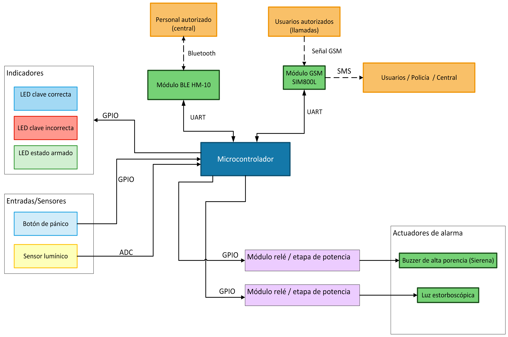

# Alarma vecinal

### Autores: Valentín Guirin, Carolina Gonzales Peralta, Yerson Michael Monzón Alayo
### Padrones: 107416, 110804, 104262

### Fecha: 2° cuatrimestre de 2025

## Selección del proyecto a implementar

### Contexto.

El proyecto a implementar tiene sus bases en la inseguridad que hoy en día está presente en la Ciudad de Buenos Aires. En particular, en las villas, donde la inseguridad es recurrente y forma parte del día a día. Dadas estas circunstancias, el cuidado entre vecinos residentes es crucial y creemos que la adquisición de una alarma vecinal como la que se propone en este informe es importante y sugiere que sería un producto potencialmente comercial.

Si bien ya existen este tipo de mecanismos, los vecinos tienden a organizarse de forma informal: grupos de mensajería, silbatos, bocinas caseras o campanas. Sin embargo, estos mecanismos suelen ser descoordinados, no escalables y dependen de que un vecino en particular esté atento, tenga crédito en el celular o pueda emitir un mensaje en el momento justo.

El presente trabajo final propone el diseño e implementación de un sistema de alarma vecinal basado en una plataforma de sistemas embebidos. El objetivo es que varios vecinos autorizados puedan activar de forma remota una sirena común mediante una llamada telefónica sin costo (llamada no contestada) o mediante un botón de pánico local, y que el sistema notifique el evento al resto de los usuarios, a la central y a la policía mediante SMS. La administración y configuración del sistema se realiza de forma remota y controlada a través de Bluetooth Low Energy (BLE) por personal autorizado enviado por la central.

### Objetivo del proyecto y resultados esperados

Se busca diseñar un nodo de alarma vecinal, instalado en la calle, que pueda ser activado de forma remota por vecinos autorizados sin costo por llamada, y también de forma local mediante un botón de pánico, y que a su vez:
- Permita una administración remota de la configuración (números autorizados, coordenadas de instalación, contactos de policía/central) mediante una conexión BLE con personal autorizado.
- Provea feedback al resto de los vecinos mediante SMS y un canal BLE hacia la central.
- Cumpla restricciones de bajo consumo, robustez y simplicidad de uso propias de un sistema embebido sin sistema operativo.

En términos técnicos, se busca materializar un sistema ciberfísico capaz de:
- Escuchar eventos externos:
	- llamadas GSM entrantes,
 	- pulsación del botón de pánico,
  	- conexión y comandos del personal autorizado vía BLE,
  	- lectura del sensor lumínico para determinar día/noche.

- Procesar mediante una máquina de estados bien definida (modo armado y desarmado, alta y baja de usuarios y configuración por BLE).
- Actuar sobre una sirena/buzzer, una luz estroboscópica, LEDs de estado y canales de comunicación (SMS / BLE) de forma determinista y medible.

### Descripción de alto nivel.

El sistema consiste en un nodo de alarma vecinal compuesto por los siguientes elementos principales:
- Placa NUCLEO-F103RB (STM32F103RB) como unidad de procesamiento central.
- Módulo GSM SIM800L para recepción de llamadas y envío de SMS.
- Módulo BLE HM-10 para vinculación con personal autorizado de la central mediante una app tipo “terminal BLE”.
- Botón de pánico montado en el gabinete de la alarma para activación manual local.
- Luz estroboscópica (accionada a través de un módulo de relé o etapa de potencia) para señalizar visualmente el estado de alarma, especialmente de noche.
- Buzzer/sirena para señalización sonora de la activación de la alarma.
- Conjunto de LEDs de estado, incluyendo al menos:
	- LED de sistema armado/encendido,
 	- LED de autenticación correcta (vía BLE),
  	- LED de autenticación incorrecta.
- Memoria no volátil (utilizando la Flash interna del STM32) para almacenar:
	- la lista de números telefónicos autorizados,
 	- las coordenadas de la alarma,
  	- las credenciales del personal autorizado,
  	- los números de contacto de usuarios, policía y central.
- Sensor lumínico (LDR + divisor resistivo) conectado a un canal ADC para detectar luz de día/noche y adaptar el comportamiento visual de la alarma (uso de la luz estroboscópica).

 

### Descripción desde el punto de vista funcional.
Desde el punto de vista funcional, el nodo de alarma vecinal se comporta como un sistema ciberfísico que recibe eventos del entorno (llamadas GSM, pulsación del botón de pánico y conexión BLE del personal autorizado), los procesa mediante una máquina de estados y actúa sobre la sirena, la luz estroboscópica y los canales de notificación por SMS. A continuación se resumen los escenarios de funcionamiento más relevantes del sistema.

- Activación por llamada GSM
	- Un vecino autorizado llama al número de la alarma.
 	- El módulo SIM800L reporta la llamada entrante y el número llamante (Caller ID) al microcontrolador.
  	- El sistema corta la llamada sin contestarla (no hay costo) y verifica si el número pertenece a la lista de números telefónicos autorizados almacenados en memoria.
  	- Si el número está registrado:
  		- el sistema pasa al estado de alarma activa,
  	 	- enciende la sirena/buzzer,
  	  	- y, si el sensor lumínico indica que es de noche, enciende también la luz estroboscópica.
  	  	- Envía SMS a los usuarios, a la policía y a la central indicando que la alarma se activó por llamada e incluye qué usuario lo hizo y las coordenadas de la alarma.
	- Si el número no está registrado:
 		- el sistema mantiene el estado de reposo (sin sirena ni luz),
   		- y notifica a la central vía SMS el número desconocido que intentó activar la alarma.

- Activación mediante botón de pánico
En este escenario el usuario no necesita disponer de un teléfono ni estar en contacto con la central: la interacción se realiza exclusivamente a través del botón de pánico instalado en el gabinete de la alarma. El siguiente flujo describe cómo se comporta el sistema cuando la alarma se dispara localmente mediante dicho botón.

	- Un usuario presiona el botón de pánico ubicado en el gabinete de la alarma.
 	- Si el sistema está armado y en reposo, se pasa al estado de alarma activa, se enciende la sirena, se acciona la luz estroboscópica en caso de ser de noche, y se envían SMS a los usuarios, policía y central indicando que la alarma se activó por botón de pánico.
  	- Si ya existe una alarma activa por llamada, el botón de pánico no cambia el tipo de evento para usuarios y policía (se mantiene “activada por llamada”), pero la central recibe información de ambas activaciones.

- Gestión y configuración vía BLE
	- Personal autorizado de la central se aproxima a la alarma y se vincula al módulo HM-10 mediante BLE desde un teléfono móvil.
 	- A través de un canal de texto, el personal ingresa su identificador de usuario y una contraseña.
  	- El microcontrolador verifica las credenciales contra las almacenadas en memoria:
  		- Si son correctas:
  	 		- se enciende brevemente el LED de autenticación correcta,
  	   		- el sistema ingresa en un modo de configuración BLE, en el cual se permite (según el permiso que la central configuró):
  	     		- dar de alta o de baja usuarios autorizados (números de teléfono),
  	       		- reiniciar el estado de la alarma en caso de ser necesario,
  	         	- ajustar la lista de números de policía.
  	    	- Al finalizar y confirmar los cambios, se almacenan en memoria no volátil y se envía un SMS a la central indicando qué usuario root ingresó y qué tipo de cambios realizó.
		- Si las credenciales son incorrectas:
  			- se activa el LED de clave incorrecta,
  	  		- se deniega la sesión de configuración,
  	    	- y se notifica a la central el intento fallido.
	- Si durante una sesión de configuración BLE se activa una alarma (por llamada o pánico), la alarma tiene prioridad: se abortan los cambios no confirmados, se cierra la sesión BLE y el sistema pasa al estado de alarma activa, notificando a la central lo ocurrido.

- Uso del sensor lumínico
	- El sensor lumínico se lee periódicamente mediante el ADC del STM32.
 	- A partir de un umbral definido, el sistema clasifica la condición como “día” o “noche”.
  	- La luz estroboscópica puede condicionarse a esta información (por ejemplo, encenderse solo de noche o con un comportamiento distinto), y la condición día/noche puede incluirse en los mensajes a la central si se considera relevante.

### Alcance del MVP.
Con el objetivo de hacer viable la implementación dentro del cuatrimestre, se definió un alcance mínimo del sistema (MVP, Minimum Viable Product). En esta sección se enumeran las decisiones de recorte y las funcionalidades concretas que se consideran obligatorias para la primera versión del nodo de alarma vecinal.

- Un único nodo de alarma vecinal, instalado en centro de la calle, sobre un poste de luz o vivienda.
- Soporte de una lista de números telefónicos autorizados almacenada en memoria no volátil.
- Dos mecanismos de activación de la alarma:
	- Llamada entrante autorizada a través de la red GSM, sin costo por llamada (llamada no contestada).
 	- Botón de pánico físico montado en el gabinete de la alarma.
- Notificación de eventos de alarma mediante:
	- Envío de SMS a:
 		- usuarios vecinos,
   		- policía,
     	- central. 

- Gestión remota vía BLE:
	- Conexión de personal autorizado de la central, autenticado mediante usuario/contraseña.
 	- Alta y baja de números de teléfono autorizados.
  	- Configuración de coordenadas de la alarma y contactos de policía/central.
- Uso de un sensor lumínico para distinguir entre día y noche y condicionar el uso de la luz estroboscópica.

- Modos de operación implementados y demostrables:
	- Modo ARMADO (sistema en espera, listo para alarmar).
 	- Modo ALARMA_ACTIVA (sirena/luz/SMS).
  	- Modo CONFIGURACIÓN_BLE (sesión de configuración con personal autorizado).

### Algunos componentes y funciones.
En esta sección se describen, de manera sintética, los componentes de hardware y módulos lógicos que intervienen en el sistema, junto con la función principal que cumple cada uno dentro de la arquitectura de la alarma vecinal. El objetivo es dejar claro qué rol tiene cada bloque antes de entrar en detalles de implementación.

- Botón de pánico: entrada digital que dispara la activación local de la alarma.
- LEDs:
	- LED de sistema armado/encendido,
 	- LED de autenticación correcta (BLE),
  	- LED de autenticación incorrecta (BLE).
- Buzzer/Sirena: elemento sonoro principal para señalización de alarma.
- Luz estroboscópica: salida de potencia (vía relé/MOSFET) para señalización visual intensa.
- Memoria no volátil: uso de la Flash interna del STM32F103RB para almacenar lista de números autorizados, coordenadas y credenciales.
- Sensor analógico lumínico: LDR + divisor resistivo conectado al ADC para distinguir día/noche.
- HM-10 (BLE): canal de comunicación con personal de la central para autenticación, configuración de usuarios y parámetros.
- SIM800L (GSM): recepción de llamadas entrantes con Caller ID y envío de SMS a usuarios, policía y central.

### Componentes principales.
A nivel de hardware, el nodo de alarma vecinal se construye a partir de una placa de desarrollo y un conjunto reducido de módulos externos que aportan conectividad, sensado y actuación. A continuación se listan los componentes principales seleccionados para la implementación del prototipo.

- NUCLEO-F103RB (STM32F103RB).
- Módulo GSM SIM800L con fuente regulada a ~4,0 V y capacidad de al menos 2 A.
- Módulo BLE HM-10 alimentado a 3,3 V.
- Botón de pánico (pulsador robusto para montaje en gabinete).
- Módulo de relé o etapa MOSFET para comando de la luz estroboscópica y/o sirena de mayor potencia.
- Buzzer/sirena 12 V para señal de alarma sonora.
- LEDs indicadores (armado, credencial correcta, credencial incorrecta).
- Sensor lumínico (LDR + resistencia fija formando divisor, conectado a un canal ADC).
- Memoria no volátil interna del STM32 (Flash), reservando páginas para configuración y whitelist.
- Fuente de alimentación con dos etapas de regulación:
	- 12 V de entrada (fuente externa),
	- conversión a 5 V para NUCLEO y periféricos de baja potencia,
	- conversión a ~4,0 V exclusiva para el SIM800L, con capacitores de reserva para picos de corriente.

## Diagrama en bloques del sistema

En la Figura 1.1 se presenta el diagrama en bloques del nodo de alarma vecinal, donde se muestran los principales módulos de hardware y las interfaces de comunicación entre ellos. El microcontrolador STM32F103RB se ubica en el centro del sistema y se conecta al módulo GSM SIM800L para llamadas y SMS, al módulo BLE HM-10 para la configuración por parte del personal autorizado, a las entradas locales (botón de pánico y sensor lumínico), a los indicadores luminosos de estado y a los actuadores de alarma (sirena y luz estroboscópica), utilizando además su memoria Flash interna como almacenamiento no volátil de la configuración y de la lista de números autorizados.

<em>Figura 1.1: Diagrama en bloques del sistema de alarma vecinal basado en GSM y Bluetooth Low Energy (BLE).</em>

## Elicitación de requisitos y casos de uso

En la Ciudad de Buenos Aires existe un competidor crucial en el mercado de la seguridad interconectada: [Verisure](https://www.verisure.com.ar/blog/alarma-barrial-que-es). Si bien es una marca de un gran calibre, consideramos que nuestro proyecto se enfoca en una zona particular y muy específica de la ciudad, dándonos la posibilidad de poder adaptar nuestro producto a las necesidades de la gente que allí resida y así poder consolidarnos en el mercado. Nuestra gran diferencia con
Verisure es que gran parte de nuestro trabajo será para reducir los costos al mínimo dado el público comprador. Evaluaremos en el transcurso del proyecto si
convendría vender al Gobierno de la Ciudad o directamente a los residentes, pero concluimos que esta cuestión no influye en los requerimientos del producto
ya que mantener los costos al mínimo y las funcionalidades que han sido mencionadas son cuestiones que mantendremos independientemente de si la alarma vecinal
llega a manos de los compradores a través del gobierno o no.

Cabe destacar que, si bien Verisure es nuestro competidor de mayor escala, actualmente hay otras empresas que se dedican a fabricar alarmas no vecinales pero
que tienen el potencial como para hacerlo. En ese caso, habría más competencia pero creemos que si logramos enfocarnos en las prioridades del costo y
funcionalidades, podremos hacernos con parte de la ciudad.

En la Tabla 1.1 se presentan los requisitos del proyecto, organizados por grupo (acceso, indicadores, interruptores, memoria, comunicación y sensores).
| Grupo | ID | Descripción |
| :---- | :---- | :---- |
|Acceso|1.1|El sistema permitirá el acceso mediante BLE.|
||1.2|En caso de acceso permitido, el sistema guardará qué usuario root que ingresó|
|Indicadores|2.1|El sistema contará con un indicador luminoso (luz estorboscópica) para indicar que hay una alerta.|
||2.2|El sistema contará con un buzzer (sirena) para indicar la activación de la alarma.|
||2.3|El sistema contará con un set de leds para indicar que la clave es correcta.|
||2.4|El sistema contará con un set de leds para indicar que la clave es incorrecta.|
||2.5|El sistema enviará un mensaje a la policía, a todos los usuarios y a la central mediante GSM para indicar qué usuario activó la alarma mediante llamada.|
||2.6|El sistema enviará un mensaje a la policía, a todos los usuarios y a la central mediante GSM para indicar que la alarma se activó mediante botón de pánico.|
||2.7|El sistema contará con un led para indicar el estado de la alarma (armada o desarmada).|
|Interruptores/Botones|3.1|El sistema contará con un botón para accionar la alarma de forma manual (botón de pánico).|
|Memoria|4.1|El sistema contará con una memoria para almacenar datos.|
||4.2|La memoria almacenará la lista de números telefónicos autorizados.|
||4.3|La memoria almacenará las coordenadas (configuradas por la central) de la ubicación de la alarma.|
|Comunicación audio|5.1|El sistema contará con un buzzer (sirena) para transmitir la alerta.|
|Comunicación BLE|6.1|El personal autorizado enviado por la central se vinculará con el sistema mediante BLE.|
|Comunicación GSM|7.1|El sistema se comunicará con los usuarios mediante la red GSM (vía SMS).|
||7.2|El sistema se comunicará con la policía mediante la red GSM (vía SMS).|
||7.3|El sistema se comunicará con la central mediante la red GSM (vía SMS).|
|Sensores|8.1|El sistema contará con un sensor lumínico para validar la luz de día.|
|Entrega|9.1|La reentrega del proyecto está prevista para el primer cuatrimestre lectivo de 2026.|

<em>Tabla 1.1: Requisitos del proyecto</em>

En la Tabla 1.2 se presenta el caso de uso en el cual un vecino autorizado activa la alarma mediante una llamada GSM al número asignado al nodo. El sistema recibe la llamada a través del módulo SIM800L, obtiene el número llamante y lo compara contra la lista de teléfonos autorizados almacenada en memoria no volátil. Si el número está registrado, la llamada se corta sin costo, se activa la sirena y, en función del sensor lumínico, se enciende o no la luz estroboscópica. Finalmente, se envían mensajes SMS a los usuarios, a la policía y a la central indicando que la alarma fue activada por llamada y especificando qué usuario la disparó.

| Elemento | Definición |
| :---- | :---- |
|Disparador|El usuario llama al número de la alarma.|
|Precondiciones|El sistema está encendido (led de estado armado), las luces estorbostópicas apagadas y buzzer inactivo.|
|Flujo principal|El usuario llama al número guardado (previamente en su lista de contactos) de la alarma, el sistema corta la llamada, valida que el usuario esté registrado. En caso de estar registrado, enciente la sirena, la luz estorboscópica (si es de noche) y notifica a la policía, a los usuarios y a la central que se activó la alarma mediante llamada (y quién lo hizo).|
|Flujo alternativo|A. El usuario no está registrado, el sistema corta la llamada y revisa en su memoria si el número está en la base de datos. Al no encontrarlo, mantiene las precondiciones en el mismo estado y notifica a la central el número que fue utilizado. B. Múltiples usuarios llaman, el sistema recibe la llamada pues corta todas a la brevedad. El sistema activó la alarma en la primer llamada, y mientras más llamadas lleguen en los próximos 60 segundos, no reaccionará más que enviando los números de las redundantes llamadas a la central.

<em>Tabla 1.2: casos de uso: el usuario activa la alarma mediante la red GSM (llamada)</em>

En la Tabla 1.3 se describe el caso de uso correspondiente a la activación local de la alarma mediante el botón de pánico instalado en el gabinete del nodo. En este escenario, cualquier persona que se encuentre en la zona puede disparar la alarma sin necesidad de contar con un teléfono móvil ni estar incluida en la lista de números autorizados. Al presionar el botón, el sistema pasa al estado de alarma activa, enciende la sirena y, si es de noche, la luz estroboscópica, y notifica por SMS a los usuarios, a la policía y a la central que la activación se produjo por botón de pánico. También se contemplan situaciones en las que el botón se presiona mientras ya hay una alarma en curso, registrándose el evento principalmente a nivel de la central.

| Elemento | Definición |
| :---- | :---- |
|Disparador|El usuario presiona el botón de pánico.|
|Precondiciones|El sistema está encendido (led de estado armado), las luces estorbostópicas apagadas y buzzer inactivo.|
|Flujo principal|El usuario presiona el botón de pánico ubicado debajo de la alarma. Se enciente la sirena, la luz estorboscópica (si es de noche) y notifica a la policía, a los usuarios y a la central que se activó la alarma mediante botón de pánico.|
|Flujo alternativo|A. El usuario presiona el botón cuando ya hay una llamada activa, la alarma se activa pero por la llamada previa. Los usuarios y la policía reciben el mensaje de que la alarma fue activada por lllamada, mientras que la central recibe las dos activaciones. B. El usuario presiona el botón cuando ya está sonando la alarma. La central es la única notificada y el estado de la alarma no cambia.|

<em>Tabla 1.3: casos de uso: el usuario activa la alarma mediante botón de pánico (llamada)</em>

En la Tabla 1.4 se detalla el caso de uso en el que el personal autorizado de la central accede al sistema mediante una conexión BLE utilizando el módulo HM-10. El usuario se aproxima a la zona de la alarma, se conecta con una aplicación tipo terminal BLE, e ingresa su identificador y contraseña para autenticarse. Una vez validado, puede dar de alta o de baja números telefónicos autorizados y modificar parámetros de configuración, como las coordenadas del nodo o los contactos de la central y la policía. Tanto la información del personal que se conectó como los cambios realizados se notifican a la central mediante SMS, y si durante la sesión se dispara una alarma, la configuración en curso se cancela y se prioriza la gestión del evento de alarma.

| Elemento | Definición |
| :---- | :---- |
|Disparador|El personal autorizado se conecta mediante BLE.|
|Precondiciones|El sistema está encendido (led de estado armado), las luces estorbostópicas apagadas y buzzer inactivo.|
|Flujo principal|El personal autorizado se aproxima a la zona de la alarma, se conecta mediante BLE, ingresa su número de usuario y contraseña. Puede dar de alta o de baja usuarios. Tanto al información del personal autorizado como los cambios que realizó, se notifican a la central mediante SMS.|
|Flujo alternativo|A. El usuario o contraseña son incorrectos, se denega el acceso y se notifica a la central. B. Se activa la alarma mientras se están realizando cambios, se cancelan los cambios (no se guardan), y se cierra la comunicación BLE hasta que la alarma se desactive.|

<em>Tabla 1.4: casos de uso: el personal autorizado se conecta mediante BLE al sistema (llamada)</em>

